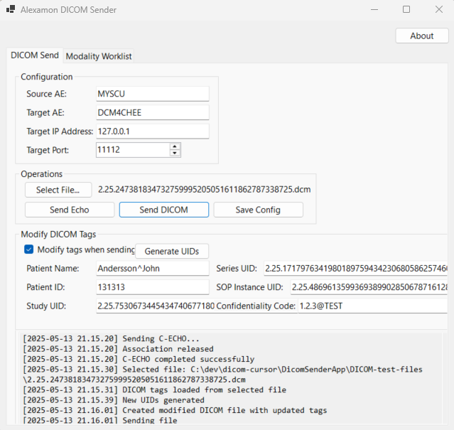
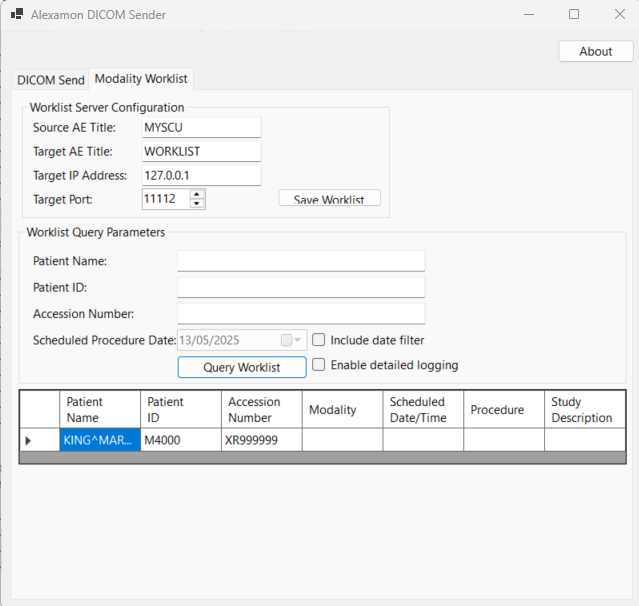

# 🩻 DICOM Sender (C-STORE SCU)

A simple Windows Forms application that acts as a **DICOM C-STORE sender** and a **DMWL Client** built with [.NET 9](https://dotnet.microsoft.com/en-us/download/dotnet/9.0) and the open-source [fo-dicom](https://github.com/fo-dicom/fo-dicom) library. The app allows users to send `.dcm` files to a PACS or DICOM receiver using configurable AE titles, IP address, and port.





---

## ✨ Features

- 📤 **Send DICOM Files** using the C-STORE operation (via `DicomClient`)
- 🖥 **Windows Forms GUI** for ease of use
- ✅ Asynchronous network operations to keep the UI responsive
- 📂 Browse for `.dcm` files using standard file picker
- 🛠 Modify DICOM tags before sending (Patient Name, ID, UID values)
- 🔁 Automatically generate new Study/Series/SOP Instance UIDs
- 📋 Real-time logging of operations and errors

---

## 🖼 GUI Overview

- **Configuration Panel**  
  - Source AE Title  
  - Target AE Title  
  - Target IP Address  
  - Target Port  

- **Operations Panel**  
  - Select File button with path display  
  - `Send Echo` (C-ECHO verification)  
  - `Send DICOM` (C-STORE operation)  
  - Save config to file (coming soon or optional)

- **Tag Modification Panel**  
  - Modify Patient Name, ID, Study/Series/SOP UIDs  
  - Auto-generate UIDs  
  - Toggle to enable/disable tag modification

- **Log Output**  
  - Displays status of C-ECHO, C-STORE, and file operations  

---

## 🚀 How to Tag
1. git tag v1.1.0
2. git push origin v1.1.0

---

## 🚀 How to Build

1. Make sure [.NET 9 SDK](https://dotnet.microsoft.com/en-us/download/dotnet/9.0) is installed.
2. Clone the repo and navigate to the project folder.
3. Build a release version:

   ```bash
   dotnet publish -c Release -r win-x64 --self-contained true /p:PublishSingleFile=true
